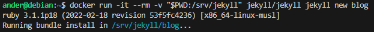

Ander Pelayo Remesal

# Práctica: Creación de blogs con Jekyll en Docker

## Creación de un contenedor Docker con Jekyll

En esta práctica utilizaremos la imagen por defecto `jekyll/jekyll`.

```
docker run -it --rm -v "$PWD:/srv/jekyll" jekyll/jekyll jekyll
```


### `jekyll new`

Este comando nos permite crear la estructura de directorios y los archivos necesarios de un nuevo proyecto Jekyll.

```
docker run -it --rm -v "$PWD:/srv/jekyll" jekyll/jekyll jekyll new blog
```



Una vez ejecutado esto tendremos que editar el archivo `Gemfile` para introducir una gema que falta y sin la cual no funcionaria correctamente.   


### `jekyll serve`

Este comando nos permite servir de forma local un sitio HTML estático generado a partir del contenido del proyecto Jekyll.

```
docker run -it --rm -p 4000:4000 -v "$PWD:/srv/jekyll" jekyll/jekyll jekyll serve --force_polling
```


La opción `--force_polling` permite que el contenido del sitio se vaya generando automáticamente cuando existe algún cambio en los archivos del proyecto.   

Una vez terminado todos estos paso podremos ver la pagina desde nuestro buscador.

  

Para tener una explicacione mas extensa tambien puedes consultar este enlace:  
[Video](https://drive.google.com/file/d/1C5LdTGW_Ai2U71Hyaz-U_RW0WfNMGvWz/view?usp=sharing)
