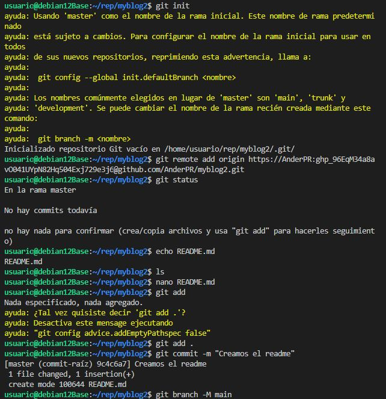

# Sitio web de Implantación de aplicaciones web
## Ander Pelayo Remesal

   
- Lo primero que realizaremos es la creacion de los directorios tanto el servidor como en le github, posteriormente los conetamos remotamente y creamos desde el servidor el archivo README.md

   
- En este captura cambiarmos a la rama gh-pages y subimos el readme.

   
- Ahora crearemos el sitio jecklly y lo subiremos al repositorio de github.  

   
- Posteriormente cuando lo tengamos todo sincronizado activaremos el sitio para poder entrar.
  
   
- Modificaremos el archivo _config.yml
  
  
- Finalmente la pagina por defecto nos quedara tal y como lo vemos en la imagen.
